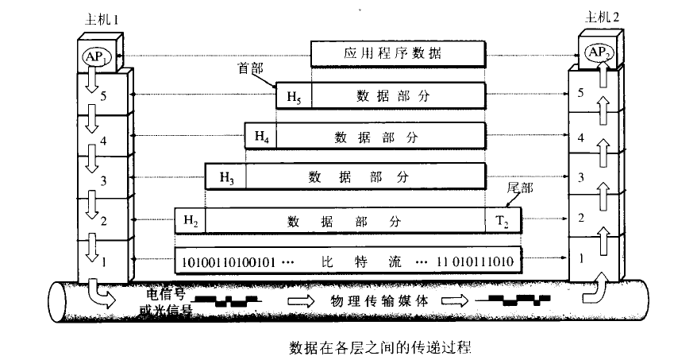

# overview
通信协议是指双方实体完成**通信或服务所必须遵循的规则和约定**。协议定义了**数据单元使用的格式**，信息单元应该包含的信息与含义，连接方式，信息发送和接收的时序，从而确保网络中数据顺利地传送到确定的地方。  
一层套一层的  

# 组成
|osi|主要的分层|说明|代表协议|传输对象|
|-|-|-|-|-|
|应用层 表达层 会话层|应用层||HTTP HTTPS FTP SMTP DNS Telnet POP3 SNMP NFS|报文 message|
|运输层|运输层||TCP UDP|tcp 报文段 segment  udp 数据报 datagram|
|网络层|网络层||IP ICMP ARP|分组、数据包 packet|
|数据链路层 物理层|网络接口层||PPP Etherent|帧 frame|

HTTP 超文本传输协议（浏览网页服务）
TFTP 文件传输协议（较快，但是不可靠）
FTP 文件传输协议（提供文件上传，文件下载服务，较慢但是可靠）
NFS 网络文件系统（Unix和Linux系统之间共享文件）
SMTP 简单邮件传输协议（邮件的发送和转发）
POP3 接收邮件（由服务器下载到本地）
Talnet (远程登录功能（配置交换机、路由器）)
SNMP 简单网络管理协议（通过网管软件来管理网络）
DNS 域名系统，将域名解析为IP地址（将百度的域名转换为服务器的IP地址）  

[osi](https://cf-assets.www.cloudflare.com/slt3lc6tev37/3L6e3OwCgSWOxp79AJUzXs/bcc453b68a03ae5a83bda4e5453984d1/osi-model-7-layers_zhCN.svg)
# 各层功能
  

## 应用层的逻辑
应用层:负责应用程序之间的数据交流  
[HTTP](/communication-protocol/http.html) HTTPS FTP SMTP DNS Telnet POP3 SNMP NFS  

## 运输层的逻辑
用户数据报协议  
应用层:负责应用程序之间的数据交流  
端口：
- 一个端口只能被一个进程占用  
- 一个进程可以占用多个端口；  
- 一个端口就是一个数据通道，  
- 端口是一个无符号16位整数(0~65535)  
五元组：网络中标识一条信息的具体流向，源端口、目的端口、源IP地址、目的IP地址、协议  
[TCP](/communication-protocol/tcp.html) [UDP](/communication-protocol/udp.html)  

## 网络层的逻辑
[IP](/communication-protocol/ip.html) ICMP [ARP](/communication-protocol/arp.html)

## 网络接口层的逻辑
以太网协议规定，接入网络的设备都必须安装网络适配器，即网卡，数据包必须是从一块网卡传送到另一块网卡。而网卡地址就是数据包的发送地址和接收地址，有了MAC地址（网卡编号）以后，以太网采用广播形式，把数据包发给该子网内所有主机，子网内每台主机在接收到这个包以后，都会读取首部里的目标MAC地址，然后和自己的MAC地址进行对比，如果相同就做下一步处理，如果不同，就丢弃这个包。  
链路管理、帧同步、寻址、流量控制、差错控制  
MAC地址（网卡编号）：48位的二进制数。表示为12位的16进制数。分为两部分：前24位为厂商编号，后24位为网卡的编号（由专门的机构分配）  
PPP [Etherent](/communication-protocol/etherent.md)  

# title
# title
# title
# title
# title
# 端口范围
|0-6535|||
|-|-|-|
|1-255|知名的端口号||
|256-1023|unix系统占用||
|1024-5000|tcp / ip临时分配的端口||
|>5000|给其他服务预留的||

# ip协议版本
- ipv4  
- ipv6  

# overview
是一种局域网技术。
- 经典以太网 3-10mb/s  
- 交换式以太网 100mb/s以上 广泛应用。  
-   
# mac地址
MAC地址也叫物理地址、硬件地址，由网络设备制造商生产时烧录在网卡(Network lnterface Card)的EPROM(一种闪存芯片，通常可以通过程序擦写)。IP地址与MAC地址在计算机里都是以二进制表示的，IP地址是32位的，而MAC地址则是48位的。

# [流 streaming](/communication-protocol/streaming.md)

# [从输入url到看到页面效果](/communication-protocol/urlRenderer.html)