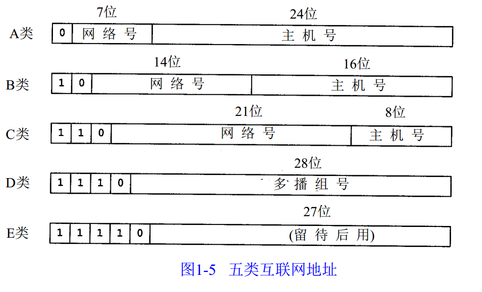

# overview
一般基于Etherent协议  
IP地址分类：IPV4长32位共4个字节（用点分十进制记法表示），由网络地址和主机地址组成。网络地址表示其属于互联网的哪一个网络，主机地址表示其属于该网络中的哪一台主机。二者是主从关系；又按字节分成4段，每个字段是一个字节，8位，最大值是255。  
  

IP地址根据网络号和主机号分为A、B、C三类及特殊地址D、E。 全0和全1的都保留不用。  
A类：(1.0.0.0-126.0.0.0)（默认子网掩码：255.0.0.0或 0xFF000000）第一个字节为网络号，后三个字节为主机号。该类IP地址的最前面为“0”，所以地址的网络号取值于1~126之间。一般用于大型网络。  
B类：(128.0.0.0-191.255.0.0)（默认子网掩码：255.255.0.0或0xFFFF0000）前两个字节为网络号，后两个字节为主机号。该类IP地址的最前面为“10”，所以地址的网络号取值于128~191之间。一般用于中等规模网络。  
C类：(192.0.0.0-223.255.255.0)（子网掩码：255.255.255.0或 0xFFFFFF00）前三个字节为网络号，最后一个字节为主机号。该类IP地址的最前面为“110”，所以地址的网络号取值于192~223之间。一般用于小型网络。  
D类：是多播地址。该类IP地址的最前面为“1110”，所以地址的网络号取值于224~239之间。一般用于多路广播用户。  
E类：是保留地址。该类IP地址的最前面为“1111”，所以地址的网络号取值于240~255之间。  
在IP地址3种主要类型里，各保留了3个区域作为私有地址，其地址范围如下：   
A类地址：10.0.0.0～10.255.255.255   
B类地址：172.16.0.0～172.31.255.255   
C类地址：192.168.0.0～192.168.255.255  
回送地址：127.0.0.1。 也是本机地址，等效于localhost或本机IP。一般用于测试使用。例如：ping 127.0.0.1来测试本机TCP/IP是否正常。  
|catagory|range||
|-|-|-|
|A|0.0.0.0 - 127.255.255.255|一般用于大型网络|
|B|128.0.0.0 - 191.255.255.255|一般用于中等规模网络|
|C|192.0.0.0 - 223.255.255.255|一般用于小型网络|
|D|224.0.0.0 - 239.255.255.255|多播地址，一般用于多路广播用户|
|E|240.0.0.0 - 247.255.255.255|保留地址|
