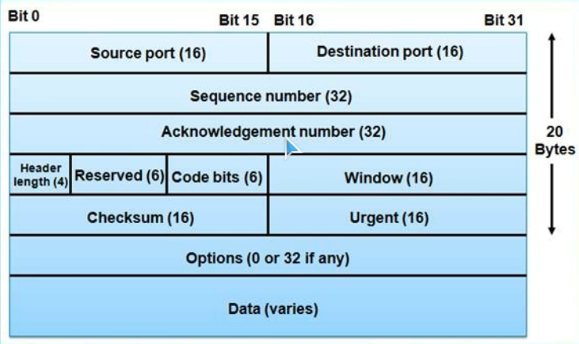

# overview
特点：面向连接、传输可靠、面向字节流  
一般基于ip协议  

- TCP 提供可靠交付的服务，保证数据无差错、不丢失、不重复、按序到达。  
- TCP 提供全双工通信。  
- TCP虽然是面向字节流的，但TCP传送的数据单元却是报文段。一个TCP 报文段分为首部和数据两部分  

  
源端口(Source Port) 目的端口(Desination Port)  
序列号(Sequence Number)【数据包的序号】  
确认号(Acknowledgment Number)（序列号+1）【用于指示下一个数据包序号】  
报头的长度(HLEN):以32字节为单位的报头长度  
保留域(Reserved)：设置为0  
编码位(Code Bits):用于控制段的传输（如会话的建立和终止）  
包括：URG、ACK、PSH、RST、SYN、FIN 6个位  
SYN（synchronous）：请求建立TCP连接  
FIN：断开TCP连接  
RST：重置TCP连接  
ACK：确认、反馈连接情况  
PSH：将数据立刻送到应用层进行处理的命令  
URG：判断紧急指针是否有效的命令  
窗口大小(Windows)：接收方能够继续接收的字节数【控制发送的速度】。只有16bit，因此最大是65535字节。  
校验和(Checksum): 包括TCP报头和数据在内的校验和【判断数据传输是否出错】  
紧急指针(Urgent Pointer)：当前序列号到紧急位置的偏移量  
选项(Option)：厂商根据需要自定义的内容  
MAC地址  
数据(Data)：上层协议数据  

# 三握 & 四挥