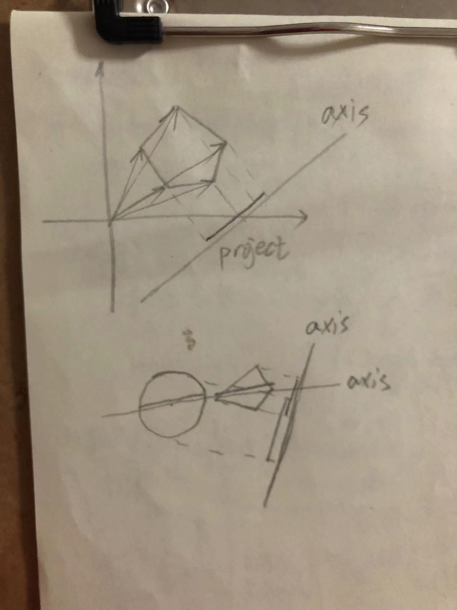

# 基础知识
canvas是html5的东西。虽然是大部分是由js处理的，但是处理的变量是canvas的“绘图环境变量”`document.getElementById('canvasId').getContext('2d')`。以后的一系列操作都是对该变量的操作。  
canvas中包含的内容，只在浏览器不支持canvas时才会显示出来。  
canvasw使用“立即模式”来绘制图像。svg使用“保留模式”来绘制图像。  
现在浏览器已经使用离屏canvas技术做了优化。请不要使用非必要的离屏canvas。  

## canvas大小
canvas有两套大小  

||||
|-|-|-|
|dom大小|css控制||
|绘图表面大小（视窗大小）|js控制|`document.getElementById('id').width`|

浏览器会把“绘图表面大小（视窗大小）”缩放到dom大小。  
canvas的绘图表面大小width/height不能使用`px`  
应该先设置绘图表面大小再改变绘图环境变量。

## canvas api
||||
|-|-|-|
|width|绘图表面宽度||
|height|绘图表面高度||
|getContext(params)|返回绘图环境变量||
|toDataURL(type, quality)|返回一个数据地址|quality控制图片的质量，`[0, 1.0]`。type:图像类型。如`image/png`,`image/jpeg`。||
|toBlob(cb, type, args...)|返回canvas的blob|cb回调方法，参数是canvas的图像的blob。type图像类型，默认`image/png`，最后一个参数控制图像的质量。|

## canvas的绘图环境。
``` js
canvas.getContext('2d') // 返回2d的绘图环境。
canvas.getContext('3d') // 返回3d的绘图环境。调用webGL
```

## 绘图环境`CanvasRenderingContext2D`对象的属性
||||||
|-|-|-|-|-|
|canvas|绘图环境所属的canvas||||
|fillstyle|填充时使用的颜色/渐变色/图案||||
|font|设置字号/字体|`20px Arial`|当字号<=13时，取13。||
|globalAlpha|设置全局透明度。|`[0, 1.0]`|计算多个不透明度时，会相乘它们。||
|globalCompsiteOperation|||||
|lineCap|设置线帽|默认`butt`|`['butt', 'round', 'squar']`||
|lineWidth|线宽|要求非负/非无穷。|默认1.0||
|lineJoin|设置相交点|默认`miter`|`['bevel', 'round', 'miter']`||
|miterLimit|设置相交点的最大长度||||
|shadowBlur|阴影的模糊值||||
|shadowColor|阴影的颜色||||
|shadowOffsetX|阴影的水平偏移值||||
|shadowOffsetY|阴影的竖直偏移值||||
|strokeStyle|设置描边的样式||||
|textAlign|文本的水平对齐方式||||
|textBaseLine|文本的竖直对齐方式||||
|save()|保存canvas状态到栈顶|以上属性都会改变当前canvas的状态。|||
|restore()|在栈顶弹出canvas状态。（即：使用弹出的canvas状态）||||
|isPointInPath(x, y)|指定的点是否在指定的路径范围内。||||

## 离屏canvas
```js
let offsetCanvas = document.createElement('canvas')
```

## 基础数学
```
Math.sin()
Math.cos()
Math.tan()

180角度 = pi弧度

单位向量：大小为1的向量
向量：{
	x,
	y,
}
向量的加/减法：向量的分量分别加/减。
向量的点积：相应分量分别相乘，再相加。结果是标量。使用用一个点表示该值，所以叫点积。  

帧：表示每秒多少个画面。
帧的倒数表示该帧经过的时间。
```

# 绘制
## 矩形
||||
|-|-|-|
|clearRect(x: number, y: number, w: number, h: number) => void|清空指定区域的像素。|使用全透明的黑色填充。|
|strokeRect(x: number, y: number, w: number, h: number) => void|描边矩形||
|fillRect(x: number, y: number, w: number, h: number) => void|填充矩形||

## 渐变
先创建渐变区域，再添加颜色。  
|||
|-|-|
|createLinearGradient(x0: number, y0: number, x1: number, y1: number)|返回线性渐变|
|createRadialGradient(x0: number, y0: number, r0: number, x1: number, y1: number, r1: number)||
|createPattern(image: HTMLImageElement | HTMLCanvasElement | HTMLVideoElement, repetition: string)|返回图像模式。`repetition: ['repeat', 'repeat-x', 'repeat-y', 'no-repeat']`|

``` js
let gradient = context.createLiearGradient
gradient.addColorStop(0, 'blue') // 位置的百分值 颜色
gradient.addColorStop(1, 'yellow')
// 放射渐变同理
let pattern = context.createPattern(image, 'repeat-y')
context.fillStyle = pattern
```

## 阴影
|属性||默认值|
|-|-|-|
|shadowBlur||0|
|shadowColor||0|
|shadowOffsetX||0|
|shadowOffsetY||0|  
`context.clip()`也把操作范围限制在指定区域内。  

```js
context.rect(x, y, w, h)
context.clip()
// ...
```

## 限制作图范围
可实现剪纸效果。  
```js
context.rect(x, y, w, h)
context.clip()
```

## 路径/描边/填充
|||||
|-|-|-|-|
|arc(x, y, r, startAngle, endAngle, counterClockWise)||||
|beginPath()|重置当前路径|||
|closePath()|闭合当前路径|不要手动使用2个重叠的点去实现闭合路径。||
|fill()|使用fillStyle属性填充|||
|rect(x, y, w, h)||||
|stroke()|使用strokeStyle属性描边|||
|moveTo(x, y)||||
|lineTo(x, y)||||  

**非零环绕规则**  
当一条线段与路径上的直线或曲线相交时，就改变计数器的值，若与路径的顺时针部分相交，则+1，若与路径的逆时针部分相交，则-1。若计数器的值不是0，则此区域在路径内，调用fill()，否则不调用fill()。  

<details>
  <summary>折叠文本</summary>
  此处可书写文本
  嗯，是可以书写文本的
</details>

## 一像素问题
一个像素的范围内绘制装修像素宽的线段是不可能的，所以左右2个方向上的半像素都被扩展为一个像素。  
现代浏览器已经都实现了抗锯齿技术。  

## 贝塞尔曲线
|||||
|-|-|-|-|
|arcTo(x0, y0, x1, y1, r)|2个点确定的线为切线。r为半径。|||
|quadraticCurveto(px, py, x, y)|第一个点是控制点，第二个点是锚点。|||
|bezierCurveTo(px0, py0, px1, px2, x, y)前两个点是控制点，第三个点是锚点。|||

[编辑贝塞尔曲线-demo0](/html/canvas/demo0.html)  

## 坐标变换
|||||
|-|-|-|-|
|rotate(angle)|旋转|||
|scale(x, y)|缩放|||
|translate(x, y)|平移|||
|transform(a, b, c, d, e, f)|变换|||
|setTransform(a, b, c, d, e, f)|变换到|||

## 图像合成
有兼容性问题。chrome/firefox实现效果不同。  

|||||
|-|-|-|-|
|source-atop||||
|source-in||||
|source-out||||
|source-over||||
|destination-atop||||
|destination-in||||
|destination-out||||
|destination-over||||
|lighter||||
|copy||||
|xor||||

[图像合成-demo1](/html/canvas/demo1.html)  

# 文本
|||枚举值|默认值|
|-|-|-|-|
|strokeText(text, x, y)||||
|fillText(text, x, y||||
|measureText(text)||||
|font||||
||font-style|normal itelic oblique||
||font-variant|normal small-caps|normal|
||font-weight|normal(400) bold(700) bolder lighter number|normal|
||font-size|xx-small x-small medium large x-large xx-large smaller larger length %|normal|
||line-height|浏览器强制设置为normal.||
||font-family|||
|textAlign|水平对齐方式|start center end left right||
|textBaseline|竖直对齐方式|top bottom middle alphabetic ideographic hanging||  
|measureText(text)|返回TextMetircs对象。|TextMetircs: {width: 该字体时文本的像素宽度}||
|font||||
|font||||

默认字形：'10px sans-serif'  
[在圆弧周围绘制文本-demo2](/html/canvas/demo2.html)  
光标的高度：字母M的宽度×(1+1/6)  
[文本编辑器-demo3](/html/canvas/demo3.html)  

# 图像与视频
||用法|||
|-|-|-|-|
|`drawImage(image, dx, dy)`|把指定图像绘制在canvas的指定区域上。|可控制图像的缩放||
|`drawImage(image, dx, dy, dw, dh)`|把指定图像绘制在canvas的指定区域上。|||
|`drawImage(image, sx, sy, sw, sh, dx, dy, dw, dh)`|把图像的指定区域绘制在canvas的指定区域上。|||
|getImageData(sx, sy, sw, sh)|返回指定区域的图像的ImageData对象|该ImageData.data是一个数组，包含4*sw*sh个整数。每4个整数表示一个像素，它们分别表示：红/绿/蓝/不透明度alpha。imageData.width !== sw imageData.width:设备像素，sw:css像素的单位。||
|putImageData(imageData, dx, dy, dirtyX, dirtyY, dirtyWidth, dirtyHeight)|把脏数据复制到canvas的指定区域。|||
|createImageData(w, h)|创建并返回ImageData对象|可以操作每一个像素||
|createImageData(imageData)||||

|ImageData对象||||
|-|-|-|-|
|width|以设备像素（px）为单位的图像数据宽度|||
|height||||
|data|像素数值组成的数组-TypedArray|||

## 离屏canvas: 不在屏幕上的canvas
<details>
	<summary>
		由js操作dom生成的canvas。	
	</summary>
	<pre>
		let canvas = document.getElementById('canvas'),
			context = canvas.getContext('2d'),
			offsetCanvas = document.createElement('canvas'),
			offsetContext = offsetCanvas.getContext('2d')
		offsetContext.drawImage(image, 0, 0)
		context.drawImage(offsetCanvas, 0, 0)
	</pre>
</details>
现代浏览器已经做了离屏canvas，若程序员再用代码实现离屏canvas，则会效率变低。  
当图像复杂时使用offsetCanvas可方便绘制。  

### 效率
drawImage > 操作图像（getImageData等）> 递归canvas > 离屏canvas  
绘制canvas = 绘制image  
绘制递归canvas用时较多。因为需要浏览器使用离屏canvas处理。  
不要频繁使用getImageData()获取少量数据。  

<details>
	<summary>剪辑区+绘制图像</summary>
	<pre>
		context.beginPath()
		// ...
		context.close()
		context.clip() // 定义剪辑区
		context.drawImage(image, 0, 0)
	</pre>
</details>

## 绘制视频
```
// html

// js
let canvas = ...,
	video = ...;
function animate () {
	if (!video.ended) {
		context.drawImage(video, 0, 0)
		window.requestNextAnimationFrame(animate) // 这是一个自定义方法
	}
}
video.onload = () => {
	window.requestNextAnimationFrame(animate) // 这是一个自定义方法
}
```

# 动画
## 动画循环
- 不使用`setTimeoute / setInterval`处理动画。  
- 基于`requestAnimationFrame()`处理动画。  

requestAnimationFrame(cb)  
该方法在浏览器方便时执行一次回调方法   
cb(time)  
	time执行回调函数的时刻。  
	对于此参数，作者没找到权威的说明。  
	不是从1970年到现在的毫秒值。  
返回id  
cancelAnimationFrame(id) 取消回调  

### requestAnimationFrame(cb)
该方法在浏览器方便时执行一次回调方法   
[demo-requestAnimationFrame](/html/canvas/requestAnimationFrame.html)  

### 封装`requestNextAnimationFrame()`
``` js
window.requestNextAnimateionFrame = (
	function () {
		return window.requestAnimationFrame || window.webkitRequestAnimationFrame || window.mozRequeatAnimationFrame || window.msRequestAnimationFrame || function (cb, element) {
			var self = this, start, finish;
			window.setTimeout(function () {
				start = +new Date()
				cb(start)
				finish = +new Date()
				self.timeout = 100 / 60 - (finish - start)
			}, self.timeout)
		}
	}
)
```
## 帧
表示动画快慢的单位。（f/s）每秒多少个画面。fps。  
表示每个画面用时 = 1/fps。  
<details>
	<summary>计算帧速率</summary>
	<pre>
		let lastTime = 0
		function calcFps () {
			let now = +new Date()
			let fps = 1000 / (now - lastTime)
			lastTime = now
			return fps
		}
		function animate(time) {
			// ...
			calcFps()
		}
		requestNextAnimationFrame(animate)
	</pre>
</details>

## 良好的绘图方式
- 绘制完背景后，若要修改画面，则定义剪辑区后再绘制。  
- 利用双缓存：将所有东西绘制在offsetCanvas后再绘制到canvas上。现代浏览器已经实现了双缓存技术，若程序员再实现它，是影响运行效率。  

## 基于时间的运动
```
s = v * t
  = v / fps

let v = 50
let fps
function calcFps () {...}
function animate () {
	fps = calcFps()
	context.clearRect()
	let dx = v / fps
	let dy = v2 / fps
	context.drawImage(image, sx, sy, sw, sh, dx, dy, dw, dh)
	// ...
}
```

# 精灵
||||
|-|-|-|
|top|||
|left|||
|width|||
|height|||
|velociityX|||
|velociityY|||
|behaviors||function[]|
|painter|||
|visible|||
|animating|是否正在动画|boolean|
先执行行为，再执行绘制。  

```js
class Sprite {
	constructor({name ='', left = 0, top = 0, width = 0, height = 0, vx = 0, vy = 0, visible = true, animating = false}, painter, behaviors = []) {
		this.name = name
		this.left = left
		this.top = top
		this.width = width
		this.height = height
		this.vx = vx
		this.vy = vy
		this.visible = visible
		this.animating = animating
		this.painter = painter // object
		this.behaviors = behaviors // 可优化为map对象
        // this.behaviors: map = {
        //     key: fn,
        //     ...
        // }
        this.tempRandomArr = new Set()
        while (tempRandomArr.size < behaviors.length) {
            tempRandomArr.push(Math.floor(Math.random() * 100000))
        }
        // array
        // obj
        // set
        // map
        if (Array.isArray(behaviors)) {
            this.behaviors = new Map()
            behaviors.forEach((fn, index) => {
                this.behaviors.set(this.tempRandomArr(index), fn)
            })
        } else {
            Object.entries(behaviors).forEach(([k, v]) => {
                this.behaviors.set(k, v)
            })
        }

	}
	paint(context) {
		if (this.painter && this.visible) {
			this.painter.paint(this, context)
		}
	}
	update(context, time) {
		this.behaviors.forEach(behavior => {
			behavior.execute(this, context, time)
		})
	}
	// update painter

	// add behavior
    addBehavior(key, value = null) {
        if (!value) {
            value = key
            do {
                key = Math.floor(Math.random() * 100000)
            } while (this.tempRandomArr.has(key))
            key = this.tempRandomArr[this.tempRandomArr.length - 1]
        }
        this.behaviors.set(key, value)
    }
	// remove behavior
    removeBehavior(key) {
        this.behavior.delete(key)
    }
	// clear behavior
    clearBehavior() {
        this.behavior = new Map()
    }
}
```

## 精灵的绘制
- 描边/填充绘制器  
- 图像绘制器  
- 精灵表绘制器  

```js
let ballPainter = {
	paint: (sprite, context) => {
		// 暂存当前绘图环境
		context.save()
		// 绘图
		// 弹出当前绘图环境
		context.restore()
	}
}
let ball = new Sprite('ball', ballPainter)

class ImagePainter {
	constructor(src) {
		this.image = new Image()
		this.image.src = src
	}
	paint(sprite, context) {
		if (this.image.complete) {
			context.drawImage(this.image, sprite.left, sprite.top, sprite.width, sprite.height)
		}
	}
}
let bomb = new Sprite('bomb', new ImagePainter('./file.png'))

class SpriteSheetPainter {
	constructor(imageUrl = '', cells = []) {
		this.image = new Image()
		this.image.src = imageUrl
		this.cells = cells
		this.cellIndex = 0
	}
	advance() {
		if (this.cellIndex >= this.cells.length - 1) {
			this.cellIndex = 0
		} else {
			this.cellIndex++
		}
	}
	paint(sprite, context) {
		if (this.image.complete) {
			let cell =this.cells[this.cellIndex]
			context.drawImage(this.image, cell.x, cell.y, cell.w, cell.h, sprite.left, sprite.top, cell.w, cell.h)

		}
	}
}
```

## 精灵的行为
```
let behaviors = [
	{
		lastTime: 0,
		execute: function (sprite, context, time) { // 必须使用function函数。
			sprite.left += sprite.vx * (time - this.lastTime) / 1000
			if (sprite.left > context.canvas.width) {
				sprite.left = 0
			}
			lastTime = time
		}
	}
]
new Sprite('name', painter, behaviors)
```

- [demo-plainSprite](/html/canvas/demo-plainSprite.html)  
- [demo-imageSprite](/html/canvas/demo-imageSprite.html)  
- [demo-spriteSheetSprite](/html/canvas/demo-spriteSheetSprite.html)  
- [demo-move](/html/canvas/demo-move.html)  
- [demo-moveBaseFps](/html/canvas/demo-move.html)  

## 操作多个精灵
```
let sprites = [new Sprite(...), ...]
function animate(time) {
	...
	sprites.forEach((sprite) => {
		sprite.update(context, time)
		sprite.paint(context)
	})
}
...
```

# 物理效果
运动都需要以像素为单位，不像素为单位需要转换为以像素为单位。  
1. 定义每个像素等价于多少米。`let mppx = 0.2`  
2. 根据物理公式算出位移`s`。  
3. 换算出应该移动的像素。`s / mppx`  

[demo-launch.html]()  

## 时间扭曲
按照某种特效所需要的时间来修改。  
需要设置动画时长。  
```js
// defind
class AnimationTimer {
	constructor(duration, timeWarp) {
		this.duration = duration
		this.timeWarp = timeWarp
		this.stopWatch = new StopWatch()
	}
	start() {
		this.stopWatch.start()
	}
	stop() {
		this.stopWatch.stop()
	}
	elapseTime() {
		if (!this.stopWatch.running) {
			return undefined
		}
		let elapseTime = this.stopWatch.elapseTime()
		if (!this.timeWarp) { // 扭曲方法不存在
			return elapseTime
		} else {
			let percentComplete = elapseTime / duration
			return elapseTime * (this.timeWarp(percentComplete) / percentComplete)
		}
	}
	isRunning() {
		this.stopWatch.running
	}
	isOver() {
		return this.duration < this.stopWatch.elapseTime()
	}
	// 缓入运动
	static easeIn(strength) => (percentComplete) => Math.pow(percentComplete, strength * 2)
	// 缓出运动
	static easeOut(strength) {
		return (percentComplete) => {
			return 1 - Math.pow(1 - percentComplete, strength * 2)
		}
	}
	// 缓入缓出运动
	static easeInOut() {
		return (percentComplete) => {
			return percentComplete - Math.sin(percentComplete * 2 * Math.PI) / (2 * Math.PI)
		}
	}
	// 弹簧运动
	static elastic(passes = 3) {
		return (percentComplete) => {
			return ((1 - Math.cos(percentComplete * Math.PI * passes)) * (1 - percentComplete)) + percentComplete
		}
	}
	// 弹跳运动
	static bounce(bounces) {
		let fn = AnimationTimer.elastic(bounces)
		return (percentComplete) => {
			percentComplete = fn(percentComplete)
			return percentComplete <= 1 ? percentComplete : 2 - percentComplete
		}
	}
	// 线性运动
	static linear = () => (percentComplete) => percentComplete
}
class StopWatch {
	constructor() {
		this.timeArr = []
		this.running = false
		this.beginTime = 0
	}
	start() {
		if (!this.running) {
			this.running = true
			this.beginTime = +new Date()
		}
	}
	split() {
		if (this.running) {
			this.timeArr.push(+new Date())
		}
	}
	stop() {
		if (this.running) {
			this.timeArr.push(+new Date())
			this.running = false
		}
	}
	elapseTime() {
		if (this.running) {
			return +new Date() - this.beginTime
		} else {
			let len = this.timeArr.length
			if (len) {
				return this.timeArr[len - 1] - this.beginTime
			} else {
				return 0
			}
		}
	}
	reset() {
		this.timeArr = []
		this.beginTime = 0
	}
}
// use
let ANIMATION_DURATION = 1000;
animationTime = new AnimationTimer(ANIMATION_DURATION, AnimationTimer.easeOut(2))
````

# 碰撞检测
## 外接矩形判别法
```js
```

## 外接圆判别法
```js
let isOverlap = (a, b) => {
	let ar = Math.max(a.width, a.height) / 2
	let ax = a.left + ar
	let ay = a.top + ar
	let br = Math.max(b.width, b.height) / 2
	let bx = b.left + br
	let by = b.top + br
	return Math.hypot(ax - bx, ay - by) <= ar + br
}
```

## 事前碰撞检测
## 事后碰撞检测
## 光影投射法
一般用于处理抛物线。  
画一条与物体运动方向相同的线，记作l1，再画一条从起点到目标点的线，记作l2。当满足以下2点时，物体移动到目的地。  
1. l1/l2的相交点在目标点允许的范围内。  
2. 物体在l2的另一边。  

## 分离轴定理（SAT）
- 一般用凸多边形。  
- 若任意一条轴上投影不重叠，则没有碰撞。  
- 性能不是太好。  

<details>
	<summary>点</summary>
<pre>
	class Point {
		constructor(x = 0, y = 0) {
			this.x = x
			this.y = y
		}
		distanceWithPoint(p) {
			return Math.hypot(this.x - p.x, this.y - p.y)
		}
		// 中心对称
		// 轴对称
	}
</pre>
</details>

<details>
	<summary>向量</summary>
<pre>
	class Vector {
		constructor(x = 0, y = 0) {
			this.x = x
			this.y = y
			// this.magnitude = Math.hypot(this.x, this.y)
		}
		// set x(x) {
		// 	this.x = x
		// }
		// setX(x) {
		// 	this.x = x
		// 	this.magnitude = Math.hypot(this.x, this.y)
		// }
		// setY(y) {
		// 	this.y = y
		// 	this.magnitude = Math.hypot(this.x, this.y)
		// }
		opposite() {
			return new Vector(-this.x, -this.y)
		}
		add(v2) {
			return new Vector(this.x + v2.x, this.y + v2.y)
		}
		subtract(v2) {
			return this.add(v2.opposite())
		}
		product(v2) {
			if (Vector.prototype.isPrototypeOf(v2)) {
				this.x *= v2.x
				this.y *= v2.y
				return this
			} else {
				this.x *= v2
				this.y *= v2
				return this
			}
		}
		magnitude() {
			return Math.hypot(this.x, this.y)
		}
		isZero() {
			return this.magnitude() === 0
		}
		isParallel(v2) {
			if (!this.magnitude() || !v2.magnitude()) {
				return false
			} else if (this.y === 0 || v2.y === 0) {
				return !this.y && !v2.y
			} else {
				return this.x / this.y === v2.x / v2.y
			}
		}
		isEquality(v2) {
			return this.x === v2.x && this.y === v2.y
		}
		quadrant () {
			if (this.x === 0 || this.y === 0) {
				return 0
			} else if (Math.sign(this.x) > 0) {
				if (Math.sign(this.y) > 0) {
					return 1
				} else {
					return 4
				}
			} else {
				if (Math.sign(this.y) > 0) {
					return 2
				} else {
					return 3
				}
			}
		}
		vertical() {
			return [new Vector(-this.y, this.x), new Vector(this.y, -this.x)] // 第一个值是顺时针方向的。第二个是逆时针方向的。
		}
		edge(v2) { // 返回边缘向量
			let [p, q] = [this.subtract(v2), v2.subtract(this)]
			return this.magnitude() > v2.magnitude() ? [p, q] : [q, p]
		}
		normalize() { // 返回单位向量
			let m = this.magnitude()
			if (m) {
				return new Vector(this.x / m, this.y / m)
			} else {
				return undefined
			}
		}
		normal() { // 返回垂直的单位向量
			let v = this.normalize()
			if (v) {
				return v.vertical()
			} else {
				return undefined
			}
		}
		dotProduct(v2) { // 返回点积
			return this.x * v2.x + this.y * v2.y
		}
		toProject(v2) { // 把当前向量投影到v2上。
			let v2n = v2.normalize()
			if (v2n) {
				return this.dotProduct(v2n)
			} else {
				return undefined
			}
		}
		radian() { // 返回该向量的弧度 [0, 2PI)
			let res
			switch(this.quadrant) {
				case 0:
					if (this.x === 0) {
						switch (Math.sign(this.y)) {
							case 0
								res = undefind
								break
							case 1
								res = Math.PI / 2
								break
							case -1
								res = 3 * Math.PI / 2
								break
						}
					} else {
						if (this.x > 0) {
							res = 0
						} else {
							res = Math.PI
						}
					}
				break
				case 1:
				case 2:
					res = Math.acos(this.x / this.magnitude())
				break
				case 3:
					let v2 = this.opposite()
					return v2.radian() + Math.PI
				break
				case 4:
					res = Math.PI * 2 + Math.asin(this.y / this.magnitude())
				break
			}
			return res
		}
		intersectionAngle(v2) {
			return Math.abs(v2.radian() - this.radian())
		}
		// 旋转
		rotate(b) {
			let curRadian = this.radian() + b
			let r = this.magnitude()
			return new Vector(r * Math.cos(curRadian), r * Math.sin(curRadian))
		}
		rebounceWithSurface(2) {
			let rv = this.radian()
			let rm = this.normal[0].radian()
			let rr = 2 * (Math.PI / 2 - (rv - rm))
			return this.rotate(rr)
		}
		rebounceWithAxes() {
			let rv = this.radian()
			let rm = this.normal[0].radian()
			let rr = Math.PI - 2 * Math.abs(rv - rm)
			if (rm > rv) {
				return this.rotate(-rr)
			} else if (rm === rv) {
				return this.opposite() // 为了计算快一点
			} else {
				return this.rotate(rr)
			}
		}
	}
</pre>
点积的作用：
1. >0 2个向量方向大概相同。  
2. =0 2个向量方向垂直。  
3. <0 2个向量方向大概相反。  
一个向量与一个单元向量的点积，表示该向量在该单元向量的投影大小。  
</details>
<details>
	<summary>投影</summary>
<pre>
	class Projection {
		constructor(min = 0, max = 0) {
			this.min = min
			this.max = max
		}
		isOverlap(projection) {
			return this.max > projection.min && projection.max > this.min
		}
		overlap(projection) {
			if (this.isOverlap(projection)) {
				let arr = [this.min, this.max, projection.min, projection.max].sort((a, b) => a - b)
				return Math.abs(arr[2] - arr[1])
			} else {
				return 0
			}
		}
	}
</pre>
</details>
<details>
	<summary>多边形</summary>
<pre>
	class Polygon {
		constructor(points = []) {
			this.points = points
		}
		collidesWith(shape) { // 是否碰撞
			// return !this.isSeparationOnAxes(this.getAxes().concat(shape.getAxes()), shape)
			let axes = shape.getAxes()
			if (axes) { // 多边形与多边形
				return this.isSeparationOnAxes(axes.concat(this.getAxes()), shape)
			} else { // 圆与多边形
				return polygonCollidesWithCircle(this, shape)
			}
		}
		isSeparationOnAxes(axes, shape) { // 是否处于分离状态
			for (let i = 0; i < axes.length; i++) {
				let p1 = this.project(axes[i])
				let p2 = shape.project(axes[i])
				if (!p1.isOverlap(p2)) {
					// 只要有一个分离就是分离
					return true
				}
			}
			return false
		}
		getAxes() {
			let [v1, v2] = [new Vector(), new Vector()]
			let axes = []
			for (let i = 0; i < this.points.length - 1; i++) {
				v1.x = this.points[i].x
				v1.y = this.points[i].y
				v2.x = this.points[i + 1].x
				v2.y = this.points[i + 1].y
				axes.push(v1.edge(v2)[0].normal()[0])
			}
			v1.x = this.points[this.points.length - 1].x
			v1.y = this.points[this.points.length - 1].y
			v2.x = this.points[0].x
			v2.y = this.points[0].y
			axes.push(v1.edge(v2)[0].normal()[0])
			return axes
		}
		project(axis) {
			let [v, scalars] = [new Vector(), []]
			this.points.forEach(point => {
				v.x = point.x
				v.y = point.y
				scalars.push(v.dotProduct(axis))
			})
			return new Projection(Math.min.apply(null, scalars), Math.max.apply(null, scalars))
		}
		move(dx = 0, dy = 0) {
			this.points.forEach(p => {
				p.x += dx
				p.y += dy
			})
		}
		// fill(shape) {}
		// stroke(shape) {}
		createPath(context) {
			if (!this.points.length) {
				return
			}
			context.beginPath()
			context.moveTo(this.points[0].x, this.points[0].y)
			for (let i = 1; i < this.points.length; i++) {
				context.lineTo(this.points[i].x, this.points[i].y)
			}
			context.closePath()
		}
		isPointInPath(context, x, y) {
			this.createPath(context)
			return context.inPointInPath(x, y)
		}
		minimumTranslateionVector(shape) {
			return minimumTranslateionVector(shape.getAxes().concat(this.getAxes()), shape)
		}
	}
</pre>
</details>
<details>
	<summary>圆</summary>
<pre>
	class Circle {
		constructor (x = 0, y = 0, r = 0) {
			this.x = x
			this.y = y
			this.r = r
		}
		collidesWith(shape) {
			let axis = shape.getAxes()
			if (!axis) { // 圆与圆
				let distance = Math.hypot(this.x - shape.x, this.y - shape.y)
				return distance < Math.abs(this.r - shape.r)
			} else { // 圆与多边形
				return polygonCollidesWithCircle(shape, this)
			}
		}
		// isSeparationOnAxes() {}
		getAxes() {
			// return undefind
			return []
		}
		project(axis) {
			let originP = new Vector(this.x, this.y).dotProduct(axis)
			let min = originP - this.r
			let max = originP + this.r
			return new Projection(min, max)
		}
		move(dx = 0, dy = 0) {
			this.x += dx
			this.y += dy
		}
		createPath(context) {
			context.save()
			context.beginPath()
			context.arc(this.x, this,y, this, r, 2 * Math.PI, false)
			context.restore()
		}
		isPointInPath(context, x, y) {
			this.creatPath(context)
			return context.inPointInPath(x, y)
		}
		minimumTranslateionVector(shape) {
			let axes = shape.getAxes().concat(this.getAxes())
			return minimumTranslateionVector(axes, shape)
		}
	}
	function polygonCollidesWithCircle(polygon, circle) {
		let originV = new Vector(circle.x, circle.y)
		let axis = polygon.points.map(p => {
			return new Vector(p.x, p.y).subtract(originv)
		}).sort((a, b) => a.magnitude() - b.magnitude())[0]
		let axes = polygon.getAxes().concat(axis)
		return polygon.isSeparationOnAxes(axes, circle)
	}
	function minimumTranslateionVector(shape) {
		let axes = this.getAxes().concat(shape.getAxes())
		return axes.map(axis => {
			let p1 = this.project(axis)
			let p2 = shape.project(axis)
			let overlap = p1.overlap(p2)
			return {
				axis,
				overlap
			}
		}).sort((a, b) => a.overlap - b.overlap)[0]
	}
</pre>
</details>
<details>
	<summary>图像精灵</summary>
<pre>
	// 本例展示了图像与多边形结合的精灵。图像与圆结合同理。
	class ImageSprite extends Polygon {
		constructor(points = [], imageSrc, strokeStyle, fillStyle) {
			super(points)
			this.image = new Image
			this.image.src = imageSrc
			this.imageLoaded = false
			let self = this
			this.image.addEventListener('load', (e) => {
				self.imageLoaded = true
			}, false)
			this.strokeStyle = strokeStyle
			this.fillStyle = fillStyle
		}
		draw() {
			this.stroke()
			this.fill()
			this.drawImage()
		}
		drawImage() {}
		fill(context) {
			context.save()
			this.createPath()
			context.fill()
			context.restore()
		}
		stroke(context) {
			context.save()
			this.createPath()
			context.stroke()
			context.restore()
		}
	}
</pre>
</details>
<details>
	<summary>多边形精灵</summary>
<pre>
	需要再完善
	class PloygonSprite extends Ploygon {
		constructor(sprite, points) {
			super(points)
			this.sprite = sprite
		}
		paint() {
			this.sprite.paint()
		}
		update() {
			this.sprite.update()
		}
	}
</pre>
</details>

[demo-polygonProject](/html/canvas/demo-polygonProject.html)  
[demo-polygonCrash](/html/canvas/demo-polygonCrash.html)  

## 最小平移向量（MTV）
- 对于已经在重叠的形状，若要分开，需要的最小平移量。  
- 移动方向总是与轴的方向相同。  
- 该距离已经接近理论上的最小值了。  

## 图像与精灵的碰撞
有以下三种碰撞方式。  
碰撞后有移动一个的，也有移动多个的。再为形状赋质量，就可模拟物理世界了。three.js就是为三维物体赋于了质量等。先用代码画出物体，再使用公司模拟物体碰撞等。  

### 粘在一起
1. 算出mtv。  
2. 移动到刚刚分开。  

### 反弹
```js
function rebounce (shape1, shape2) {
	let mtv = shape1.minimumTranslateionVector()
	// 
}
```

## 圆形与圆形的碰撞
## 多边形与多边形的碰撞
## 圆形与多边形的碰撞
多边形对应的所有轴加上圆心与多边形与圆最近的点的向量所在的轴。
如图：

# 游戏开发
做游戏与做动画对于编码来说，没区别。  

## 游戏引擎
```js
class Game {
	constructor (gameName, canvasId) {
		this.name = gameName
		this.canvas = document.querySelector(canvasId)
		this.context = this.canvas.getContext('2d')
		this.sprites: new Map()
		this.startTime = +new Date()
		this.lastTime = null
		this.gameTime = null
		this.fps = 0
		this.STARTING_FPS = 60
		// this.paused = false
		this._animating = false
		this.startedPauseAt = null
		this.PAUSE_TIMEOUT = 100 // 可能用不上
		this.animateId = null
		this.animate = null
		this.updateFrameRate = (time) => {
			if (this.lastTime) {
				this.fps = this.STARTING_FPS
			} else {
				this.fps = 1000 / (time - this.lastTime)
			}
		}
		this.clearScreen = () => {
			this.context.clearRect(0, 0, canvas.width, canvas.height)
		}
		this.queueSource = new SourceMap()
		this.soundOn = true
		this.soundChannels = []
		this.audio = new Audio()
		this.NUM_SOUND_CHANNELS = 10 // 音频的数量
		this.NUM_SOUND_CHANNELS.forEach(() => {
			this.soundChannels.push(new Audio)
		})
		this.keyListeners = new Map()
		this.HIGH_SCORES_SUFFIX = '_highscores'
		this.over = false
		window.onkeypress = (event) => {
			this.keyPressed(event.keyCode)
		}
		this.title = 0
		this.title = 0
		this.title = 0
		this.title = 0
		this.title = 0
	}
	start() {
		this.startTime = +new Date()
		// this.clearScreen()
		this.animate = () => {
			// draw()
		}
		this.animateId = requestNextAnimateionFrame(this.animate)
	}
	end() {
		cancelNextAnimationFrame(this.animateId)
		this.over = true
	}
	get animating () {
		// this.updateFrameRate = () => {}
		return !this._animating
	}
	set animating (flag) {
		// 可使用獭方法优化
		this.animate = (time) => {
			// 处理暂停时的逻辑
		}
		if (flag) { // 开始动画
			this.animate = (time) => {
				// draw()
				this.tick(time)
				this.clearScreen()
				this.startAnimate(time)
				this.paintUnderSprites()
				this.updateSprites(time)
				this.paintSprites(time)
				this.paintOverSprites()
				// this.endAnimate()
				this.animateId = requestNextAnimationFrame(this.animate)
			}
			this.updateFrameRate = (time) => {
				if (this.lastTime) {
					this.fps = this.STARTING_FPS
				} else {
					this.fps = 1000 / (time - this.lastTime)
				}
			}
		} else { // 结束动画
			this.animate = () => {}
			this.updateFrameRate = () => {}
		}
		return this._animating = !flag
	}
	toggleAnimating () {
		this.animating = !this.animating
	}
	tick(time) {
		this.updateFrameRate(time)
		this.gameTime = (+new Date()) - this.startTime
		this.lastTime = time
	}
	// updateFrameRate(time) {
	// 	if (this.lastTime) {
	// 		this.fps = this.STARTING_FPS
	// 	} else {
	// 		this.fps = 1000 / (time - this.lastTime)
	// 	}
	// }
	clearScreen() {
		this.context.clearRect(0, 0, this.canvas.width, this.canvas.height)
	}
	updateSprites(time) {
		this.sprites.forEach(sprite => {
			sprite.update(this.context, time)
		})
	}
	getSprite(spriteName) {
		this.sprite.get(spriteName)
	}
	setSprite(sprite) {
		this.sprites.set(sprite.name, sprite)
	}
	paintSprites() {
		this.sprites.forEach(sprite => {
			sprite.paint(this.context)
		})
	}
	pixelsPerFrame(time, velocity) {
		return velocity / this.fps
	}
	ppf(time, velocity) {
		this.pixelsPerFrame(time, velocity)
	} // pixelsPerFrame的别名
	
	startAnimate() {} // 游戏开始时的动画
	paintUnderSprites() {} // 绘制背景
	paintOverSprites() {}
	endAnimate() {} // 游戏结束时的动画
	setKeyListener(key, listener) {
		this.keyListeners.set(key, listener)
	}
	getKeyListener(key) {
		this.keyListeners.get(key)
	}
	keyPressed(e) {
		let listener = this.getKeyListener(e.keyCode)
		if (listener) {
			listener()
		}
	}
	canPlaySound() {}
	// 待开发高分榜
	setHightScore() {}
	getHightScore() {}
	clearHighScore() {}
	canPlayOgggVorbis() {
		// 可优化为查出可播放类型后加载该类型的音频
		return '' !== this.audio.canPlayType('audio/ogg; codecs="vorbis"')
	}
	canPlayMp4() {
		return '' !== this.audio.canPlayType('audio/mp4')
	}
	getAvailableSoundChannel() {
		return this.soundChannels.find(audio => {
			if (audio.played && audio.played.length > 0) {
				if (audio.ended) {
					return true
				}
			} else {
				if (!audio.ended) {
					return true
				}
			}
			return false
		})
	}
	playSound(id) {
		let [track, element] = [this.getAvailableSoundChannel(), document.getElementById(id)]
		if (track && element) {
			track.src = element.src === '' ? element.currentSrc : element.src
			track.load()
			track.play()
		}
	}
	title() {}
	title() {}
	title() {}
}
class SourceMap {
	constructor(sourceName, sourceType, sourceUrl) {
		// this.name = sourceName
		// this.url = sourceUrl
		this.map = new Map()
		// this.map.set(sourceName, sourceUrl)
		this.sourceLoaded = new Set()
		this.sourceFailedToLoad = new Set()
		// this.sourceLoaded = new Set()
	}
	set(sourceName, sourceType, sourceUrl) {
		this.loadSorce(sourceName, sourceType, sourceUrl)
	}
	get(sourceName) {
		return this.map.get(sourceName)
	}
	loadedPercent() {
		return this.sourceLoaded.length / this.map.keys().length * 100
	}
	loadedCb(event) {}
	loadedErrorCb(event) {}
	loadSorce(sourceName, sourceType, sourceUrl) {
		let self = this
		// 检查重复sourceName
		// 添加资源
		switch(sourceType) {
			case 'image':
				let image = new Image()
				image.src = sourceUrl
				image.addEventListener('load', (e) => {
					self.loadedCb(e)
					self.sourceLoaded.add(sourceName)
				})
				image.addEventListener('error', (e) => {
					self.loadedErrorCb(e)
					self.sourceFailedToLoad.add(sourceName)
				})
				this.map.set(sourceName, sourceUrl)
				break
			default:
				throw new Error('暂不支持该类型的资源')
				break
		}
	}
	// 因add时就已经开始加载资源了，所以不需要laodAllSource()了。
	// loadAllSource() {}
}
```
[demo-getAway](/html/canvas/demo-getAway.html)  

### 如何使用游戏引擎
```js
const game = new Game()
const s0 = new Sprite()
const s1 = new Sprite()
game.addSprite(s0)
game.addSprite(s1)
game.paintUnderSprites()
game.paintOverSprites()
game.startAnimate()
game.endAnimate()
game.start()
game.setKeyListener(32, () => (console.log('hi')))
window.onblur = () => {
	if (!game.over && game.animating) {
		game.toggleAnimating()
	}
}
window.onfocus = () => {
	if (!game.animating) {
		game.toggleAnimating()
	}
}
```

# 自定义控件
使用canvas模拟其他控件。  
```js
class RoundeRactangle {
	...
}
class Progressbar {
	...
}
class Slider {
	...
}
class Pan {
	...
}
let CoreHtml5 = {
	RoundeRactangle,
	Progressbar,
	Slider,
	Pan,
}
module.exports = CoreHtml5
```

# 移动平台开发
## title
## title

# 物理基础知识
G=mg 物体受到的重力 = 质量×重力加速度
F=kx 弹力 = 弹性系数×形变量
F=uf 摩擦力 = 动摩擦因数×压力
a=(v0-v1)/(t0-t1)
v=v0+at
s=vt+(at^2)/2
力的三角形定则/平行四边形定则/正交分解。
F=ma 力=质量×加速度
w=(a0-a1)/(t0-t1) 角速度 = 角度差-时间差
v=wr 线速度 = 角速度×半径

# title